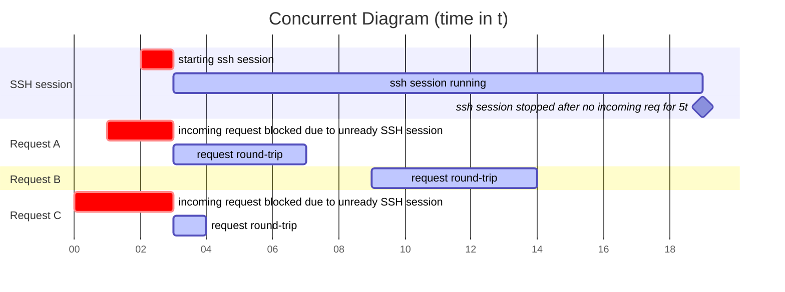

# caddy-wake-on-connect

[Caddy](https://caddyserver.com/) module/plugin that wakes the destination host on demand.

## Background
The idea behind this plugin is that a MacOS device has [Bonjour Sleep Proxy](https://en.wikipedia.org/wiki/Bonjour_Sleep_Proxy).
This proxy is used to wake a MacOS device from sleeping when there is an incoming SSH connection. You might be wondering
why not use WOL magic packet. Yes, we can use magic packet to wake any device that supports WOL. The good news is almost
every device supports this features. But there might be a problem if the device has already woken from sleep, and it 
comes back to sleep after a few minutes (depending on your sleep configuration). This is where this plugin comes in. 
When there is an incoming HTTP request, the device should be woken up by WOL (or Bonjour Sleep Proxy via SSH 
connection) and then this plugin will create an SSH connection that runs `caffeinate -i` command on MacOS (or 
`systemd-inhibit` for other Linux distros). Your server can now serve the HTTP request. When there is no in-flight 
request for X seconds, this SSH connection will be killed and your device can turn back to sleep.

Currently, I'm using this for my local homelab setup to turn on my Mac device from sleep when there is an incoming request
to Ollama Server. Here I can cut down electricity bill while keeping my system ready 24/7

## How to Configure
### Prerequisites:
1. At least 2 devices running 
   - 1 for the Caddy Server `srvA`
   - 1 for the destination server `srvB`
2. This instruction will use Docker, so you must have already installed Docker on `srvA`. You may also skip this instruction
   if you already familiar with configuring Caddy Module. But please have a check on Step 4 below
3. SSH server on `srvB` is already running
### Set Up:
1. On `srvA`, clone this repository
   ```shell
   git clone https://github.com/anantadwi13/caddy-wake-on-connect.git
   ```
2. Go to the repo directory, then generate a new SSH key
   ```shell
   cd caddy-wake-on-connect
   ssh-keygen -t ed25519 -a 100 -f ./ssh-key && echo && cat ./ssh-key.pub
   # enter twice for skipping the passphrase

   # Note:
   # this will generate a ssh-key file in this directory and returning the public key on the last line starting with `ssh-ed25519 AAAAC3NzaC1lZDI1NT...`
   ```
3. On `srvB`, add the above public key to `~/.ssh/authorized_keys`. Please do note that we will allow only specific command
   (in this case `caffeinate -i`) on `srvB`. This way we can prevent any malicious commands if the private key (`ssh-key`)
   accidentally leaks.
   ```shell
   # echo 'command="<prevent_sleep_command>",no-port-forwarding,no-x11-forwarding,no-agent-forwarding <ssh_public_key>' >> ~/.ssh/authorized_keys
   echo 'command="caffeinate -i",no-port-forwarding,no-x11-forwarding,no-agent-forwarding ssh-ed25519 AAAAC3NzaC1lZDI1NT... ubuntu@srvA' >> ~/.ssh/authorized_keys
   
   # Note:
   # you may change `<prevent_sleep_command>` to another command that can prevent your device from sleep
   ```
4. Then check SSH connection to `srvB` from `srvA`
   ```shell
   cd caddy-wake-on-connect

   # ssh -o UserKnownHostsFile=./known-hosts <srvB-username>@<srvB-IP> -t "echo OK"
   ssh -o UserKnownHostsFile=./known-hosts alice@10.10.0.5 -t "echo OK"
   # type `yes` and enter to continue. You will then get `OK` response

   # Note:
   # `-o UserKnownHostsFile` option will create a new known-hosts file in this directory
   ```
5. Now build your Caddy Server Docker image with this plugin on `srvA`
   ```shell
   cd caddy-wake-on-connect
   
   docker build -t caddy-wake-on-connect .
   ```
6. Create and configure `Caddyfile` on `caddy-wake-on-connect` directory
   ```
   # we are using nip.io dns resolver for testing
   127.0.0.1.nip.io:8080 {
       # change the reverse proxy IP to your srvB IP
       reverse_proxy 10.10.0.5:80 {
           transport http_wake_on_connect {
               # change the ssh address to your srvB IP
               woc_ssh_address 10.10.0.5:22
               # change the user of your srvB user
               woc_ssh_user alice
               woc_ssh_key_files /repo-dir/ssh-key
               woc_ssh_known_hosts_files /repo-dir/known-hosts
           }
       }
   }
   ```
7. Run Docker container on `srvA`
   ```shell
   cd caddy-wake-on-connect

   docker run --rm -it -p 8080:8080 -v $PWD:/repo-dir caddy-wake-on-connect caddy run -c /repo-dir/Caddyfile
   ```
8. Last, put `srvB` into sleep and test your Caddy Server connection from `srvA`
   ```shell
   curl -v http://127.0.0.1.nip.io:8080
   ```

## Module Options
```go
   WOCSSHUser            string         `json:"woc_ssh_user,omitempty"`              // mandatory
   WOCSSHAddress         string         `json:"woc_ssh_address,omitempty"`           // mandatory
   WOCSSHKeyFiles        string         `json:"woc_ssh_key_files,omitempty"`         // default: ~/.ssh/id_ed25519 or ~/.ssh/id_rsa, support multiple fallback keys separated by comma
   WOCSSHKnownHostsFiles string         `json:"woc_ssh_known_hosts_files,omitempty"` // default: ~/.ssh/known_hosts, support multiple files separated by comma
   WOCSSHCommand         string         `json:"woc_ssh_command,omitempty"`           // default: tail -f /dev/null, make sure to use a long-running command
   WOCSSHTimeout         caddy.Duration `json:"woc_ssh_timeout,omitempty"`           // default: 30s
   WOCSSHKeepAlive       caddy.Duration `json:"woc_ssh_keep_alive,omitempty"`        // default: 30s
   WOCSSHPollingInterval caddy.Duration `json:"woc_ssh_polling_interval,omitempty"`  // default: 250ms
```

## Design



## TODO
- Add WOL (Wake on LAN) using magic packet before sending SSH connection to support non MacOS device

## Acknowledgements
This project was also inspired by [caddy-wol](https://github.com/dulli/caddy-wol)